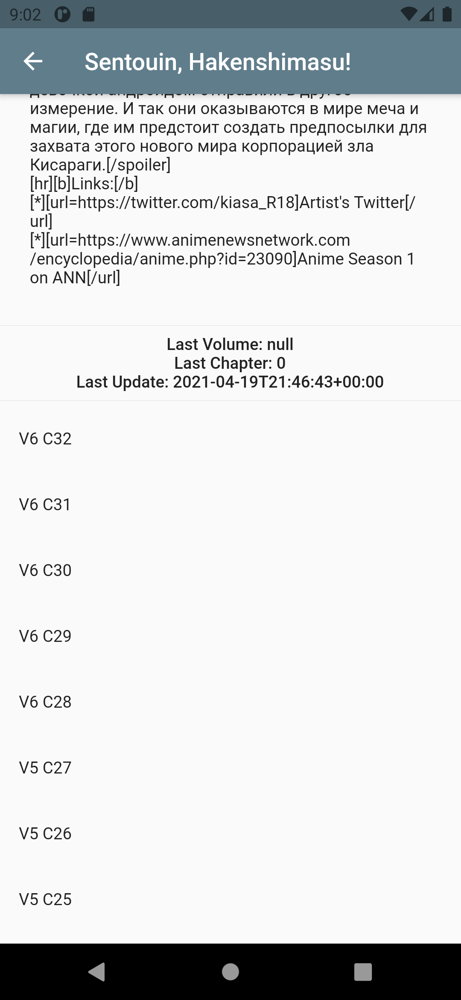

# Dex Reader

Basic MangaDex reader built on the new MangaDex v5 api with Flutter.

Take a look here: https://dexreader.simonliveshere.com/#/

Note: Both this app and the api it is built on are pretty buggy and are liable to break without warning.

To build: Make sure you have flutter >v2 sdk.
- For Android: Make sure you have the Android SDK installed and run `flutter build apk`.
- For Web: Run `flutter build web --web-renderer html`.

Unfortunately because of CORS this won't work as a web app without some more tweaking :(.

